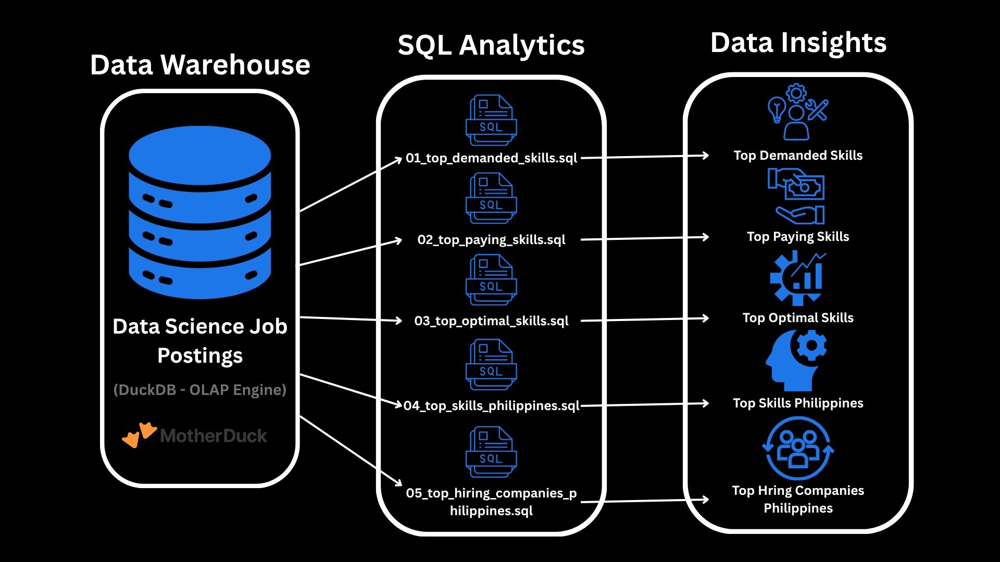
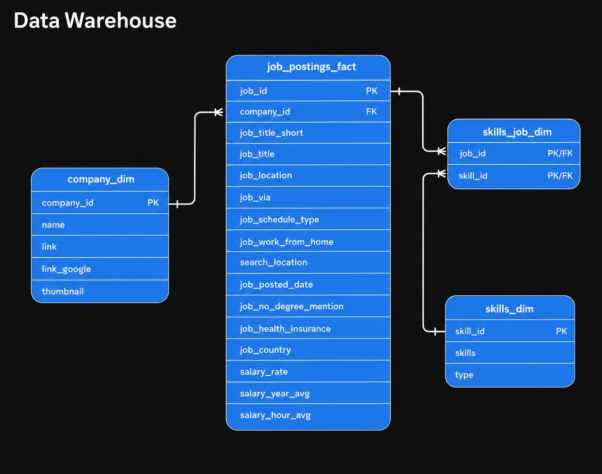

# Exploratory Data Analysis with SQL: Data Engineer Job Market Insights

The project is organized into **five SQL analysis files**, each answering a specific business question through structured SQL queries. The dataset is stored in **MotherDuck** as the cloud data warehouse and analyzed using **DuckDB**. The analyses are divided into:

- **Three Global Analyses** focused on remote Data Engineer job opportunities worldwide.
- **Two Philippine-Specific Analyses** focused on the local Data Engineer job market.

This approach enables **comparisons between international remote hiring trends and the skills and opportunities currently in demand within the Philippines**, providing data-driven insights for aspiring Data Engineers and career shifters.

## 📖 Executive Summary

This project explores the **Data Engineer Job Market** using SQL and the **Luke Barousse SQL Course Job Postings Dataset** to uncover insights from job postings through data modeling, SQL analytics, and data visualization.

- **Project Scope**: Analyze global remote and Philippine Data Engineer job postings to identify in-demand skills, salary trends, and hiring companies.
- **Data Modeling**: Utilize a relational database linking job postings, companies, and skills for analysis.
- **Analytics**: Conduct five SQL analyses covering skill demand, salaries, market value, Philippine skill demand, and top hiring companies.
- **Outcomes**: Reveal the most in-demand and valuable Data Engineering skills while highlighting hiring trends in both the global remote and Philippine job markets.

If you have time, feel free to explore the SQL analyses to see the queries, methodology, and insights behind each finding:

- 📊 **[Top In-Demand Skills](01_top_demanded_skills.sql)**
- 💰 **[Highest-Paying Skills](02_top_paying_skills.sql)**
- ⚖️ **[Most Valuable Skills (Salary vs. Demand)](03_top_optimal_skills.sql)**
- 🇵🇭 **[Top In-Demand Skills in the Philippines](04_top_skills_philippines.sql)**
- 🏢 **[Top Hiring Companies in the Philippines](05_top_hiring_companies_philippines.sql)**

## 🎯 Problem & Context

As the demand for Data Engineers continues to grow, aspiring professionals and career shifters often face challenges in identifying the most valuable skills and career opportunities. This project analyzes real-world job posting data using SQL to uncover insights that support informed skill development and career planning.

**This project focuses on:**

- Identifying the most in-demand Data Engineer skills.
- Analyzing the highest-paying technical skills.
- Balancing salary and market demand to identify the most valuable skills.
- Exploring skill demand in the Philippine job market.
- Identifying the top companies hiring Data Engineers in the Philippines.

## 🗄️ Data Warehouse & Star Schema
The analysis is built on a **star schema data model** stored in **MotherDuck**, with **DuckDB** used as the SQL query engine. The schema consists of a central fact table containing job posting records, connected to dimension tables for companies and technical skills. This design enables efficient SQL joins and analytical queries across the dataset.

### Table Descriptions

#### 📌 `job_postings_fact`
The central **fact table** containing individual job postings and their associated attributes, including job title, company, location, salary, work arrangement, and posting details. This table serves as the primary source for all analyses.

#### 🏢 `company_dim`
A **dimension table** containing company information such as the company name and related links. It is joined with the fact table to analyze hiring trends by employer.

#### 🛠️ `skills_dim`
A **dimension table** that stores the list of technical skills and their corresponding categories. It provides descriptive information for each skill referenced in job postings.

#### 🔗 `skills_job_dim`
A **bridge table** that resolves the many-to-many relationship between job postings and skills. It links each job posting to one or more required technical skills, enabling skill demand analysis.

## 🛠️ Tech Stack

| Category | Technology | Purpose |
|----------|------------|---------|
| **Database** | DuckDB | Executes SQL queries and performs exploratory data analysis. |
| **Cloud Data Warehouse** | MotherDuck | Stores and manages the job postings dataset in the cloud. |
| **Data Modeling** | Star Schema | Organizes the data into fact and dimension tables for efficient analytical queries. |
| **Development Environment** | Visual Studio Code | SQL development, query execution, and project management. |
| **Version Control** | Git & GitHub | Tracks project changes and hosts the repository for collaboration and portfolio purposes. |

## Analysis Overview

## 📊 Analysis Overview

The project is organized into five SQL analyses, each designed to answer a specific business question about the Data Engineer job market.

| Analysis | Business Question | Description |
|----------|-------------------|-------------|
| **[Top In-Demand Skills](01_top_demanded_skills.sql)** | What are the top in-demand skills for Data Engineers? | Identifies the most frequently requested skills in remote Data Engineer job postings to highlight current market demand. |
| **[Highest-Paying Skills](02_top_paying_skills.sql)** | What are the highest-paying skills for Data Engineers? | Analyzes the median annual salary associated with each skill to identify technologies linked to higher compensation. |
| **[Most Valuable Skills](03_top_optimal_skills.sql)** | What are the most valuable skills based on salary and demand? | Combines salary and market demand to determine which skills provide the greatest overall career value. |
| **[Top In-Demand Skills in the Philippines](04_top_skills_philippines.sql)** | What are the most in-demand skills for Data Engineers in the Philippines? | Examines the technologies most frequently requested by employers within the Philippine job market. |
| **[Top Hiring Companies in the Philippines](05_top_hiring_companies_philippines.sql)** | Which companies are hiring the most Data Engineers in the Philippines? | Identifies the organizations with the highest number of Data Engineer job postings in the Philippines. |

Each analysis is supported by SQL queries, query results, and business insights to transform raw job posting data into actionable career recommendations.

## 💡 Key Insights

### 🌍 Global Remote Job Market

- **SQL and Python** are the most in-demand skills for remote Data Engineer positions, making them the foundation of modern data engineering.
- **Cloud platforms** such as **AWS** and **Azure** are consistently among the most requested technologies, reflecting the industry's shift toward cloud-based data infrastructure.
- **Big data technologies** including **Spark**, **Airflow**, **Snowflake**, and **Databricks** remain essential for building scalable data pipelines and processing large datasets.
- While **Rust** achieved the highest median salary, **Terraform**, **Python**, **SQL**, and **AWS** provide the strongest balance between compensation and market demand, making them valuable skills for long-term career growth.

### 🇵🇭 Philippine Job Market

- **SQL** and **Python** are also the most requested skills in the Philippines, demonstrating strong alignment with global hiring trends.
- The Philippine market places greater emphasis on **Azure** and **Power BI**, suggesting that many local organizations value cloud computing and business intelligence capabilities.
- **IBM**, **ING**, **Thinking Machines Data Science**, and **First Datacorp** are among the organizations with significant hiring activity for Data Engineers, indicating strong employment opportunities within the local market.

### 🚀 Career Takeaways

- Build a strong foundation in **SQL** and **Python** before specializing in advanced technologies.
- Develop expertise in at least one major cloud platform, particularly **AWS** or **Azure**.
- Learn modern data engineering tools such as **Spark**, **Airflow**, **Snowflake**, and **Databricks** to align with current industry demand.
- If targeting opportunities in the Philippines, gaining experience with **Power BI** can provide an additional competitive advantage.

## 🧠 SQL Skills Demonstrated

This project demonstrates core SQL techniques used for exploratory data analysis and business intelligence on a real-world job market dataset.

| SQL Skill | Purpose |
|-----------|---------|
| **SELECT** | Retrieved relevant columns for analysis and reporting. |
| **FROM** | Queried data from fact and dimension tables. |
| **INNER JOIN** | Combined job postings, companies, and skills to perform comprehensive analysis. |
| **USING** | Simplified joins by matching common key columns (`job_id`, `skill_id`, and `company_id`). |
| **WHERE** | Filtered data based on job title, remote work status, country, and salary availability. |
| **GROUP BY** | Aggregated data to analyze demand by skills and companies. |
| **COUNT()** | Measured job demand by counting job postings and required skills. |
| **MEDIAN()** | Calculated representative salary values while minimizing the impact of outliers. |
| **ROUND()** | Improved the readability of salary values and calculated metrics. |
| **LN()** | Applied logarithmic scaling to balance demand when computing the Optimal Skill Score. |
| **HAVING** | Filtered aggregated results to ensure reliable salary analysis (e.g., skills with more than 100 job postings). |
| **ORDER BY** | Ranked results by demand, salary, and custom analytical metrics. |
| **LIMIT** | Returned the top-ranking results for focused analysis. |
| **Column Aliases (`AS`)** | Assigned meaningful names to calculated columns for improved readability. |

## 📊 Data Analysis Techniques

| Technique | Description |
|-----------|-------------|
| **Exploratory Data Analysis (EDA)** | Explored and summarized job posting data to identify trends and patterns. |
| **Data Filtering** | Filtered records by job title, location, remote work status, and salary availability. |
| **Data Aggregation** | Summarized job postings using aggregate functions to measure skill demand and hiring activity. |
| **Salary Analysis** | Used median salaries to identify the highest-paying technical skills. |
| **Demand Analysis** | Measured the frequency of skills and companies to determine market demand. |
| **Market Comparison** | Compared findings from the global remote job market and the Philippine job market to identify similarities and differences in skill demand. |
| **Custom Metric Development** | Developed an Optimal Skill Score by combining salary and demand using logarithmic scaling. |
| **Relational Data Analysis** | Queried data across fact and dimension tables using a star schema. |
| **Business Insight Generation** | Translated query results into actionable career insights. |

## 🚀 Conclusion

This project demonstrates how SQL can be used to transform raw job posting data into actionable insights for career planning and market analysis. By exploring both the global remote and Philippine Data Engineer job markets, the analyses identify in-demand skills, salary trends, and hiring patterns that can help aspiring Data Engineers prioritize their learning path and make informed career decisions.

The project also showcases practical SQL, data modeling, and analytical techniques commonly used in real-world data engineering and business intelligence workflows.

## Author

**Christian Oliver A. Olivarez**

Aspiring **Data Engineer** with a passion for data engineering, cloud technologies, and analytics. This project was developed as part of my data engineering portfolio to demonstrate practical SQL skills, data modeling, and exploratory data analysis using real-world job market data.

- 💼 LinkedIn: *https://www.linkedin.com/in/christianoliverolivarez/*
- 🐙 GitHub: *https://github.com/OlivarezChristiann*
- 📧 Email: *christianolivarez061605@gmail.com*

*This documentation was initially drafted with AI assistance and reviewed and edited by the author.*